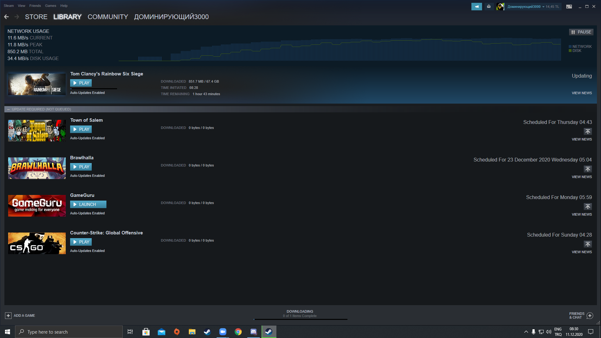

# Samsung-proje--Akilli-Triaj

Akıllı triaj uygulaması ile sağlık çalışanlarının yükünün hafifletilmesi ve COVID-19 gibi salgınlarda hasta ile sağlık çalışanının temasını azaltarak bulaş riskini azaltmak amaçlanmıştır.

## Gerekli Kütüphanelerin İndirilmesi

```bash
pip install opencv-python
```

## Ekran Resimleri




## Kodlandığı Platform

• Pycharm


